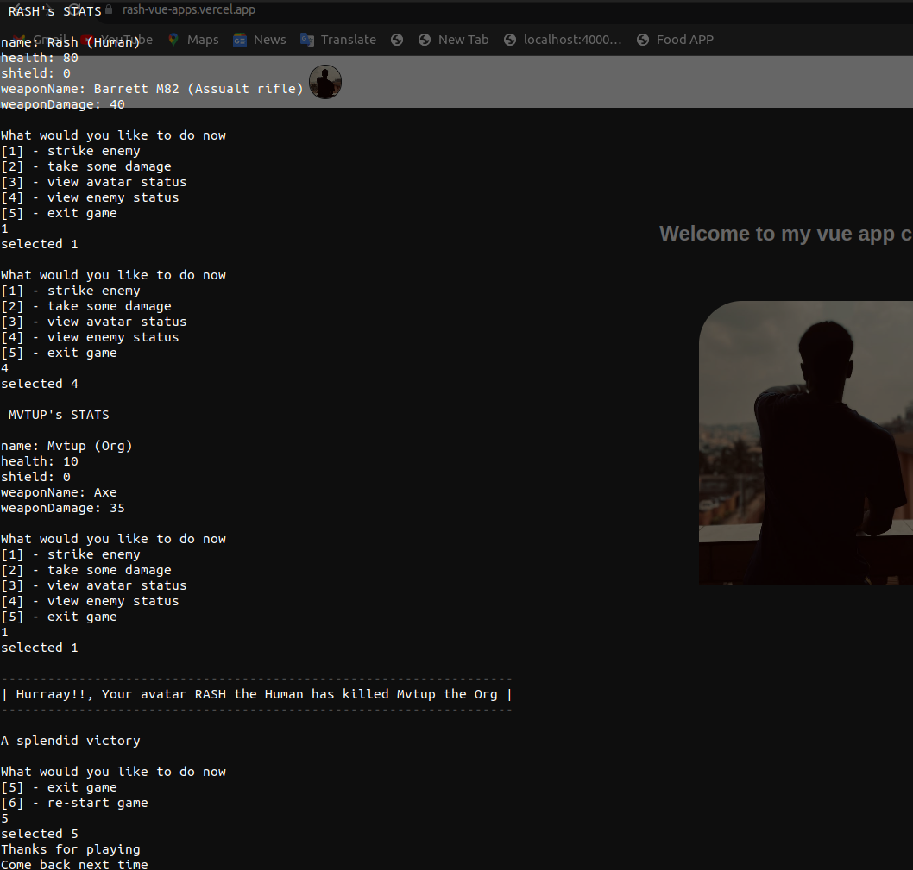

### My python sandbox

- for learning to write python
- Solving algorithms with python
- And building simple tools with python

### Notes

- So hope this semi-column-less, no variable key word, language doesn't corrupt muy urge for writing neat code in other languages like TypeScript | Java | JavaScript and other languages.

#### Other Sandboxes

I have the following sandbox repositories too.

- [JS-Sandbox](https://github.com/RashJrEdmund/js-sandbox) // JavaScript
- [Java-Sandbox](https://github.com/RashJrEdmund/java-sandbox) // Java
- [Svelte-Sandbox](https://github.com/RashJrEdmund/svelte_sanbox) // Svelte
- [Vue-Apps](https://github.com/RashJrEdmund/vue-apps) // VueJs

---
---
---

# Playing my mini game: Attack On Monsters 😅

navigate into the attack-on-monsters directory
and run

```bash
  # on ubuntu
  python3 index.py
```

- This should initialize the game and get you started.
- Follow game instructions to play

### Game description

```Attack On Monsters``` is a python Script I've written, on where the user get's to interact with the game, and take decisions that'll impact their game play.




While building this game, I got to learn a some things about python, and also, understood a few thins about the vim editor (I'm using neo Vim)

#### Enjoy a piece of ARTTT 😌

---
---
---

Also checkout my [portfolio here](https://rash-edmund.vercel.app)

## Configure virtual environment

- for this i'm using the `virtualenv` command
- __STEPS TO CREATE VIRTUAL ENVIRONMENT__
  
  - in the projects directory, at top level, run

    ```bash
      # if using the virtualenv package
      $ virtualenv venv

      # if using the default venv from python
      # on linux
      $ python3 -m venv venv
    ```

  - This should create a `venv` folder (which is the virtual environment)

  - next, you have to __activate__ the virtual environment. To do so, execute

    ```bash
      # for linux
      $ source venv/bin/activate
    ```

  - you should see you file path look similar to this

    ```bash
      (venv) username@computer:~/full/path/py-sandbox$
    ```

  - You should be able to safely install packages with `pip`
  
- Now, to install the packages in requirements.txt, execute

  ```bash
    $ pip install -r requirements.txt
    # the -r means it should read from the requirements.txt file
  ```

- __ADDING YOUR OWN PACKAGES__
  - After every package installation, I advice you update the requirements.txt file with

    ```bash
      $ pip free > requirements.txt
      # it's like package.json in JavaScript, but for python
    ```

  - you should even combine the installation command with the free command like so to execute all at once

    ```bash
      $ pip install `module_name` && pip free > requirements.txt
    ```

### Cool new commands

- `>>`
  - to use with command like `echo` or `pip free` to add content to the end of a file

- ##### Example

  - `echo "some text content" >> test_file.txt` to add the text "some text content" to the test_file.txt. this file will be created if not exit
  
- `>`
  - Same as the `>>` pattern above but will completely replace the content of the file

---
---
---

### Cool command combo

- `find . -type d -name "__pycache__" -exec rm -rf {} +`
  - to find and delete all "__pycache__" folders in the current working directory

- #### Explanation

  - `find .` : Start searching from the current directory (.)
  - `-type d` : Look for directories (d)
  - `-name "__pycache__"` : Match directories named "__pycache__"
  - `-exec rm -rf {} +` : For each found directory, execute the rm -rf command on it ({} is replaced by the found directory paths)
