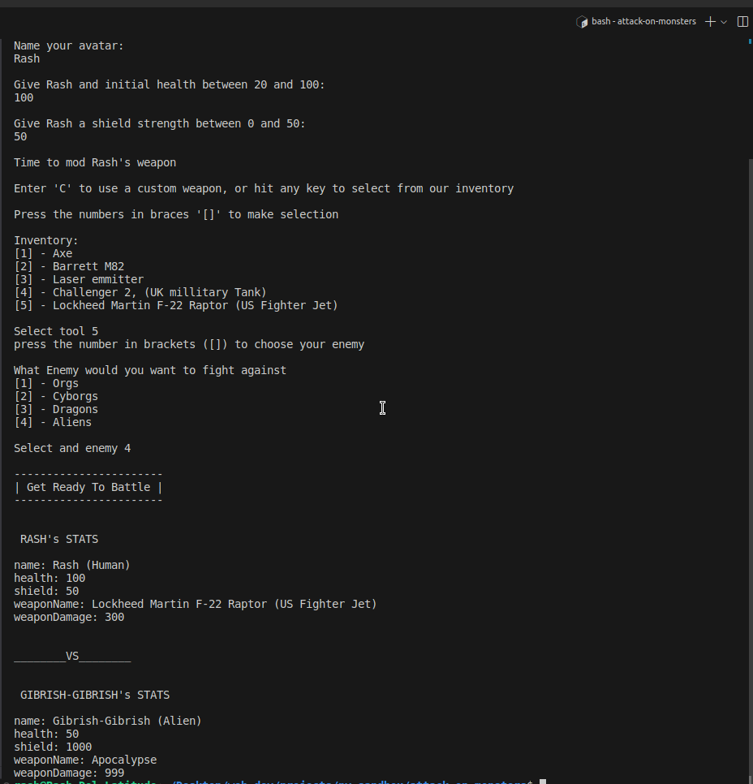

### My python sandbox

- for learning to write python
- Solving algorithms with python
- And building simple tools with python

### Notes

- So hope this semi-column-less, no variable key word, language doesn't corrupt muy urge for writing neat code in other languages like TypeScript | Java | JavaScript and other languages.

#### Other Sandboxes

I have the following sandbox repositories too.

- [JS-Sandbox](https://github.com/RashJrEdmund/js-sandbox) // JavaScript
- [Java-Sandbox](https://github.com/RashJrEdmund/java-sandbox) // Java
- [Svelte-Sandbox](https://github.com/RashJrEdmund/svelte_sanbox) // Svelte
- [Vue-Apps](https://github.com/RashJrEdmund/vue-apps) // VueJs

---
---
---

# Playing my mini game: Attack On Monsters 😅

navigate into the attack-on-monsters directory
and run

```bash
  # on ubuntu
  python3 index.py
```

This should initialize the game and get you started.

### Game description

```Attack On Monsters``` is a python Script I've written, on where the user get's to interact with the game, and take decisions that'll impact their game play.



While building this game, I got to learn python, and also, understand a few thins about the vim editor (I'm using neo Vim)

#### Enjoy a piece of ARTTT 😌!!

---
---
---

Also checkout my [portfolio here](https://rash-edmund.vercel.app)
